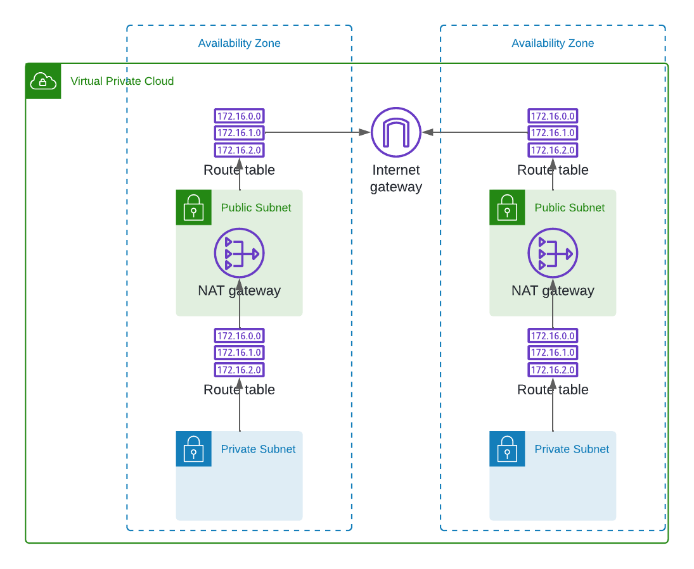
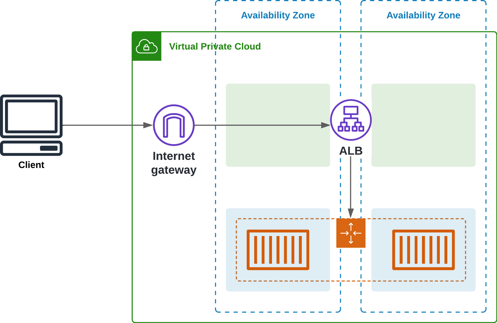

# Business Case: Deploying a NestJS Application on Amazon ECS with AWS CDK

## Overview

This project demonstrates the deployment of a NestJS application on Amazon Elastic Container Service (ECS) using Fargate, showcasing core AWS services in compute, and networking. The deployment is managed through AWS Cloud Development Kit (CDK), offering infrastructure as code (IaC) capabilities, which aligns with modern DevOps practices.

## Business Objectives

**Scalability**: Utilize Amazon ECS with Fargate to automatically scale the application based on traffic demands, ensuring consistent performance and availability.

**Security**: Implement a secure network architecture with public and private subnets across multiple Availability Zones (AZs), using security groups and NAT gateways to control inbound and outbound traffic.

**Cost Optimization**: Leverage Fargate's serverless model to optimize cost by only paying for the compute resources required to run the containers, with the flexibility to scale down during low traffic periods.

**Operational Efficiency**: Use AWS CDK to automate the deployment, configuration, and management of the infrastructure, reducing manual efforts and potential errors, and enabling faster iterations and deployments.

**High Availability**: Distribute resources across two Availability Zones, ensuring redundancy and minimizing downtime in case of an AZ failure.

## Technical Architecture

1. **Amazon ECS with Fargate**:

- Deploy the NestJS application as a containerized service.
- Use a Fargate cluster to manage the task definition, which includes the container image and resource allocation.

2. **Networking**:



- **VPC**: A dedicated Virtual Private Cloud to isolate the resources.
- **Subnets**: 4 subnets across two Availability Zones, with 2 public subnets for internet-facing resources and 2 private subnets for backend services.
- **Internet Gateway**: Allows outbound internet access from the public subnets.
- **NAT Gateways**: Two NAT gateways in the public subnets to enable outbound internet access from the private subnets.
- **Security Group:** A security group that allows inbound traffic on port 80 (HTTP) for the application, ensuring controlled access.

3. **Load Balancing**:



- Application Load Balancer (ALB): Distributes incoming traffic to the ECS tasks, improving the application's fault tolerance and scaling capabilities.
- Target Group: Routes traffic to the container instances on port 80.

4. **Deployment with AWS CDK**:

- Define the infrastructure as code using AWS CDK in TypeScript.
- Automate the creation of ECS clusters, task definitions, services, networking components, and security configurations.
- Enable continuous deployment and integration with AWS CDK's stack management.

5. **Use Cases**

- Web Application Hosting: The deployed NestJS application can serve as a high-performance, scalable web application, handling varying loads with minimal downtime.
- Microservices Architecture: This setup can be extended to host multiple microservices, each running in separate containers, managed by ECS, and integrated via the load balancer.
- DevOps Demonstration: The project serves as a practical example of modern DevOps practices, showcasing IaC, and automated deployment on AWS.

## How to run the project

### Prerequisites

1. **AWS Account**: You need an AWS account to deploy the infrastructure.
2. **AWS CLI**: Install and configure the AWS CLI on your local machine.
3. **Node.js**: Install Node.js and npm to run the CDK application.

### Steps

1. **Clone the Repository**:

```bash
git clone https://github.com/sergioyepes21/nestjs-ecs-cdk.git
cd nestjs-ecs-cdk
```

2. **Install Dependencies**:

```bash
npm install
```

4. **Push the image into an ECR repository**:

```bash
# Authenticate Docker to ECR
# Create a repository (if not already created)
aws ecr create-repository --repository-name $REPOSITORY_NAME --region $AWS_REGION

# Build the Docker image
docker build -t nestjs-ecs-cdk-backend-api -f ./backend/backend-api/Dockerfile .

# Tag the Docker image
docker tag nestjs-ecs-cdk-backend-api:latest $AWS_ACCOUNT_ID.dkr.ecr.AWS_REGION.amazonaws.com/$REPOSITORY_NAME:latest

# Push the image to ECR
docker push $AWS_ACCOUNT_ID.dkr.ecr.AWS_REGION.amazonaws.com/$REPOSITORY_NAME:latest

# Verify the image
aws ecr describe-images --repository-name $REPOSITORY_NAME --region $AWS_REGION
```

5. **Set the Environment Variables**:
   Set the environment variables described in the `.env.example` file.

6. **Deploy the Infrastructure**:

```bash
npm run deploy -- --filter @nestjs-ecs-cdk/ecs-cdk
```

## Conclusion

This project highlights the practical application of AWS services to deploy a scalable, secure, and cost-effective web application. It serves as a strong demonstration of your AWS expertise, particularly in compute, networking, and provides a robust foundation for further expanding cloud skills.
